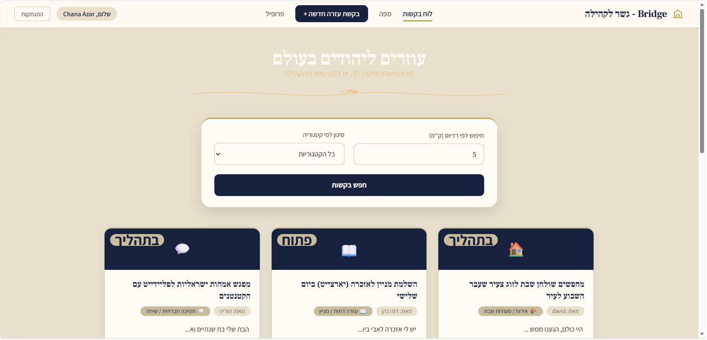
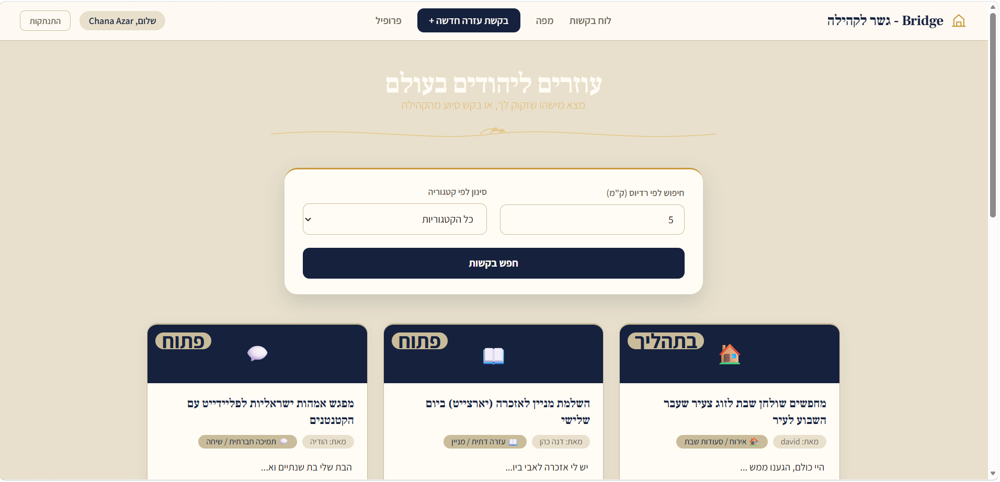
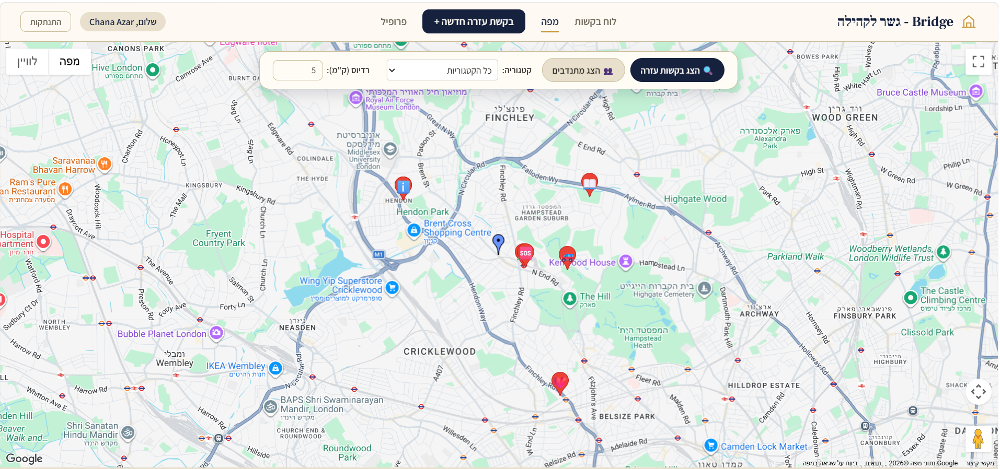
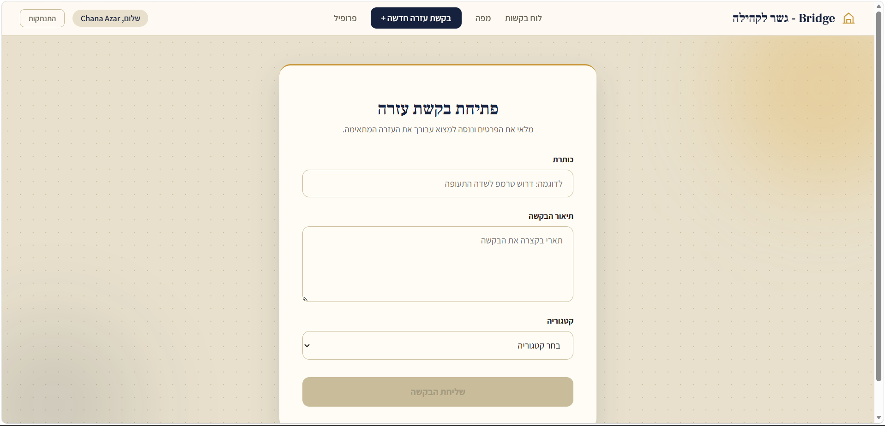
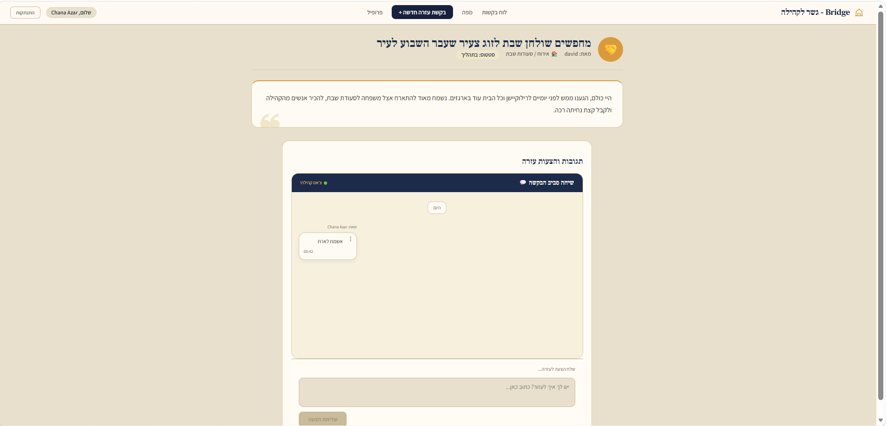
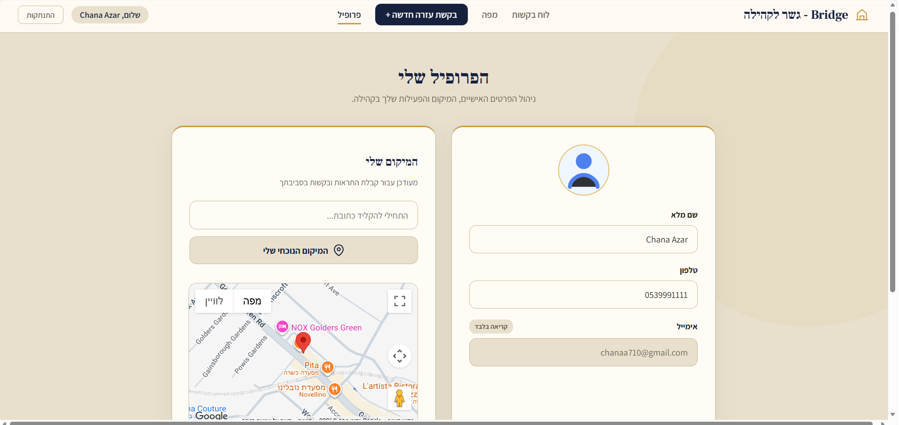
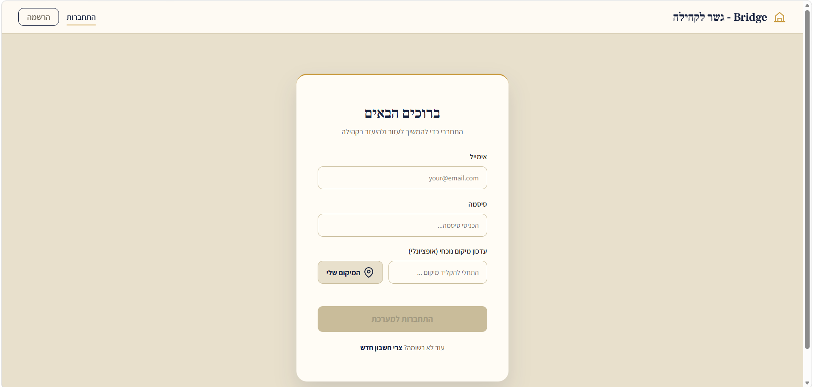
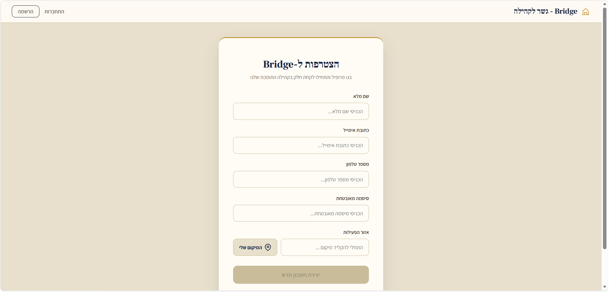

# 🌉 Bridge – Location-Based Community Help Platform

<p align="center">
  
  
  
  
</p>

<p align="center">
  
</p>

**Bridge** is a web application for mutual help between neighbors and community members. Users can post **help requests** categorized by type, browse an **interactive map** of nearby requests and users, and respond to requests with **answers / offers of help**. The project follows a full **Client-Server** architecture: a modern Angular client talking to a layered ASP.NET Core API.

---

## 📋 Table of Contents

- [Key Features](#-key-features)
- [Screenshots](#-screenshots)
- [Architecture & Tech Stack](#️-architecture--tech-stack)
- [Recommended Repository Structure](#-recommended-repository-structure)
- [Prerequisites](#-prerequisites)
- [Setup & Run](#-setup--run)
- [Main API Endpoints](#-main-api-endpoints)
- [Data Model](#-data-model)
- [License](#-license)

---

## ✨ Key Features

- 🔑 **User registration and login**, including saved address/geographic location
- 📍 **Automatic location detection** (Geolocation) and address autocomplete (Google Places Autocomplete)
- 🗺️ **Interactive map (Google Maps)** displaying help requests and users by radius and category
- 🗂️ **Categories** for classifying help requests (with icons)
- 📝 **Help request management** – create, edit, delete, change status (`Open` / `InProgress` / `Closed` / `Canceled`)
- 💬 **Answering requests** – any user can respond and offer help on an existing request
- 👤 **Personal user profile** with editable details and location
- 🔎 **Geographic (nearby) search** for requests and users within a given radius, using spatial queries

---

## 📸 Screenshots

### 🏠 Dashboard

<p align="center">
  
</p>

### 🗺️ Interactive Map

<p align="center">
  
</p>

### ➕ Create Help Request

<p align="center">
  
</p>

### 💬 Request Details & Answers

<p align="center">
  
</p>

### 👤 User Profile

<p align="center">
  
</p>

### 🔐 Authentication

<p align="center">
  
  
</p>

---

## 🏗️ Architecture & Tech Stack

The project is split into two independent parts that communicate over a REST API:

```
┌─────────────────────┐        HTTPS/REST        ┌──────────────────────────┐
│   Client (Angular)   │  ───────────────────────▶ │   Server (ASP.NET Core)  │
│  localhost:4200      │  ◀─────────────────────── │   localhost:7161         │
└─────────────────────┘                            └──────────────────────────┘
                                                              │
                                                              ▼
                                                    ┌──────────────────────────┐
                                                    │   SQL Server (BridgeDB)  │
                                                    └──────────────────────────┘
```

### 🖥️ Client – Angular

| Component | Technology |
|---|---|
| Framework | Angular 20 (Standalone Components, Signals) |
| Routing | Angular Router |
| HTTP communication | `HttpClient` |
| Maps | `@angular/google-maps` + Google Maps JavaScript API |
| Forms | Reactive Forms |
| Styling | Angular Material (Material Theme), CSS |

Main structure:
```
src/app/
├── classes/       # Models/interfaces (Request, User, Answer, Category...)
├── component/     # Components: login, register, map, request-dashboard...
├── pipes/         # Custom pipes (status, truncate)
├── services/      # HTTP services calling the API (RequestService, UserService...)
├── app.routes.ts  # Routing configuration
└── app.config.ts  # Application configuration
```

### ⚙️ Server – ASP.NET Core (Bridge)

The backend follows an **N-Tier / Layered Architecture** with a clear separation of concerns:

| Layer (Project) | Responsibility |
|---|---|
| `Bridge.Api` | Controllers, startup configuration, CORS, Swagger |
| `Bridge.Service` | Business logic |
| `Bridge.Core` | Interfaces, Models, AutoMapper profiles |
| `Bridge.Data` | Data access – EF Core DbContext, Repositories, Migrations |

| Technology | Purpose |
|---|---|
| .NET 8 / ASP.NET Core Web API | Server layer |
| Entity Framework Core 8 | ORM for SQL Server |
| **NetTopologySuite** | Geographic (spatial) queries – search by location and radius |
| AutoMapper | Mapping between Entities and DTOs |
| Swagger / Swashbuckle | Interactive API documentation |
| Repository Pattern | Data access abstraction |

---

## 📁 Recommended Repository Structure

Right now you have two separate parts (the Angular `src` folder and the .NET `Bridge` solution). Since this is a single **Full Stack project**, it's best practice to **avoid** splitting it into two separate repositories, and instead organize it as a **monorepo** with a `client` folder and a `server` folder at the root. This gives you one shared README, one shared Git history, and it's easy to keep client and server changes in sync:

```
bridge-community-help/          👈 repository root on GitHub
├── client/                     👈 all Angular project content (current myproject)
│   ├── src/
│   ├── public/
│   ├── angular.json
│   ├── package.json
│   ├── package-lock.json
│   ├── tsconfig*.json
│   └── .gitignore              (node_modules, dist, .angular, etc.)
│
├── server/                     👈 all .NET project content (current Bridge)
│   ├── Bridge.Api/
│   ├── Bridge.Core/
│   ├── Bridge.Service/
│   ├── Bridge.Data/
│   ├── Bridge.sln
│   └── .gitignore              (bin/, obj/)
│
└── README.md                    👈 this file
```

**Why this is better:**
1. **Single context** – anyone visiting the repo immediately sees both client and server, and understands it's one complete product.
2. **Synchronized versions** – if you change the API, you can update the client in the same commit/PR, without syncing across two repos.
3. **Simpler CI/CD** – easy to set up a single pipeline that builds both `client` and `server`.
4. **One clear README** – instead of two half-explained READMEs, you get one full, central document (like this one).

> 💡 Tip: to move the existing project into this structure — copy the **contents** of your `myproject` folder (including `src`, `public`, `angular.json`, `package.json`, etc.) into `client/`, and the **contents** of your `Bridge` folder (all 4 projects plus the `.sln` file) into `server/`.

---

## 🔧 Prerequisites

Before installing, make sure you have:

- [Node.js](https://nodejs.org/) (version 20+) and npm
- [Angular CLI](https://angular.dev/cli) – `npm install -g @angular/cli`
- [.NET 8 SDK](https://dotnet.microsoft.com/download/dotnet/8.0)
- SQL Server (LocalDB / Express / full) + [SQL Server Management Studio](https://learn.microsoft.com/sql/ssms/download-sql-server-management-studio-ssms) (optional)
- Your own **Google Maps JavaScript API** key (see security notes below)

---

## 🚀 Setup & Run

### 1️⃣ Running the Server

```bash
cd server
```

Update the connection string in `Bridge.Api/appsettings.json` to point to your SQL Server instance:

```json
{
  "ConnectionStrings": {
    "DefaultConnection": "Server=YOUR_SERVER_NAME;Database=BridgeDB;Trusted_Connection=True;TrustServerCertificate=True"
  }
}
```

Then run the migrations to create the database:

```bash
cd Bridge.Api
dotnet ef database update --project ../Bridge.Data --startup-project .
```

And start the server:

```bash
dotnet run
```

The server will run at `https://localhost:7161`, and the interactive API documentation (Swagger) is available at:
```
https://localhost:7161/swagger
```

### 2️⃣ Running the Client

```bash
cd client
npm install
```

Create your local environment file with your own Google Maps API key:

```bash
cp src/environments/environment.example.ts src/environments/environment.ts
```

Then edit `src/environments/environment.ts` and paste in your own key:

```ts
export const environment = {
  production: false,
  googleMapsApiKey: 'YOUR_GOOGLE_MAPS_API_KEY',
};
```

Now run:

```bash
npm start
```

(This is exactly equivalent to running `ng serve` — `npm start` is simply an alias defined in `package.json` under `"scripts"` that runs the same command.)

The application will open at `http://localhost:4200`.

> ⚠️ Make sure the API base URL in the service files (`src/app/services/**/*.ts`) matches wherever your server is actually running (default: `https://localhost:7161`).

---

## 🔌 Main API Endpoints

| Method | Endpoint | Description |
|---|---|---|
| `GET` | `/api/Requests` | All help requests |
| `GET` | `/api/Requests/{id}` | Request by id |
| `GET` | `/api/Requests/nearby-requests?lat&lng&radiusInMeters&categoryId` | Requests by location/radius/category |
| `GET` | `/api/Requests/user/{userId}` | Requests belonging to a specific user |
| `POST` | `/api/Requests` | Create a new request |
| `PUT` | `/api/Requests` | Update a request |
| `PATCH` | `/api/Requests/{id}/status` | Update request status |
| `DELETE` | `/api/Requests/{id}` | Delete a request |
| `GET` | `/api/Answer/request/{requestId}` | Answers for a specific request |
| `POST` | `/api/Answer` | Add an answer |
| `GET` | `/api/Categories` | All categories |
| `GET` | `/api/Categories/{id}/requests` | Requests by category |
| `POST` | `/api/User/register` | Register a new user |
| `POST` | `/api/User/login` | Log in |
| `GET` | `/api/User/nearby-users?lat&lng&radiusInMeters` | Nearby users |
| `PUT` | `/api/User/update-location` | Update user location |
| `PUT` | `/api/User/update-profile` | Update user profile |

Full, up-to-date documentation is available via Swagger UI once the server is running.

---

## 🗃️ Data Model

**Main entities:** `User`, `Request`, `Answer`, `Category`

```
User 1───* Request  *───1 Category
Request 1───* Answer  *───1 User
```

- A **Request** contains a title, content, location (lat/lng), status (Open/InProgress/Closed/Canceled), and category.
- The database uses **NetTopologySuite** to run spatial queries (find "requests/users within X km of me").

---

## 📄 License

© 2026 chanaa710-blip. All rights reserved.

This project and its source code are proprietary. No part of this repository may be copied, modified, distributed, or used, in whole or in part, without the prior written permission of the author.

